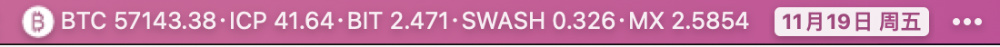
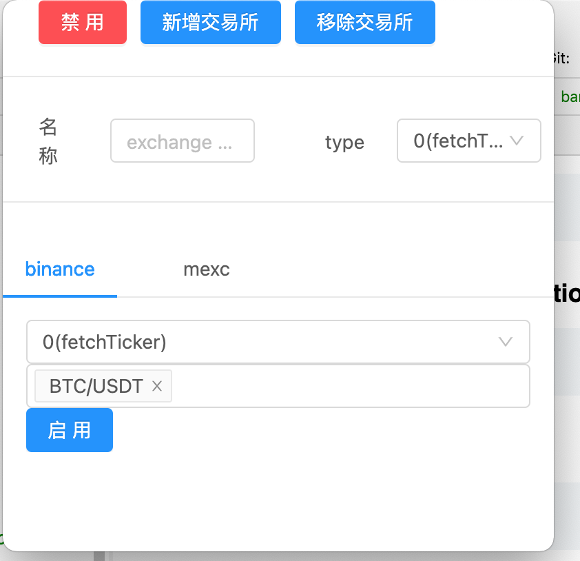

# coinbar
    a simple tool for monitoring cryptocurrency prices

## TODO
- [ ] redraw ui
- [ ] support l18n
- [ ] support export & import config
- [ ] support proxy setting
## Project setup
```
yarn
```

### Compiles and hot-reloads for development
```
yarn electron:serve
```

### Compiles and minifies for production
```
yarn electron:build
```

### Lints and fixes files
```
yarn lint
```

### Download
See [Release Page](https://github.com/Teddy-Zhu/coinbar/releases).

### screenshots
bar


operate

